<picture>
  <source media="(prefers-color-scheme: dark)" srcset="assets/hero-dark.svg">
  <source media="(prefers-color-scheme: light)" srcset="assets/hero-light.svg">
  
</picture>

I build the backend other things get built on top of: gateways, authentication and
authorization, event pipelines, multi-tenant platforms. Mostly **Java 21 / Spring Boot**
and **Go**, on **PostgreSQL**, with everything that isn't needed to answer the request
moved off the request path.

The diagram above isn't decoration — it's the service topology of a platform I run. Each
service owns its own database, reaches the others through domain events, and deploys on
its own.

---

## Selected work

| | What it is | Stack | Code |
|---|---|---|---|
| **Indoor Positioning Platform** | Hybrid indoor location — PDR · BLE · Wi-Fi · UWB · VPS — with a map studio and an analytics plane. Polyglot monorepo, 11 independently deployed services, one CI. | `Go` `Java 21` `Kafka` `PostGIS` `ClickHouse` | private |
| **CodeSpells Platform Services** | Gateway, auth (RS256 + refresh), RBAC, a generic booking engine, event-driven mail. The layer I reuse instead of writing auth for the fifth time. | `Spring Boot 3.5` `PostgreSQL 16` `RabbitMQ 4` `Redis` | [platform-commons](https://github.com/RexGm/platform-commons) |
| **PuantajOnline** | Timesheet, payroll and leave for construction sites: employer web panel plus a field app that survives bad connections and cheap Android phones. | `Spring Boot 3` `PostgreSQL` `Flyway` `React` `Expo` | private |
| **IoT Data Integrity Chain** | Telemetry you can prove wasn't edited after the fact — readings off-chain in Postgres, their hash anchored on-chain. | `Spring Boot` `Hyperledger Fabric` `MQTT` `React` | [repo](https://github.com/RexGm/iot-data-integrity-chain) |
| **Entropy** | A personal feed where every post decays on a timer and is then genuinely deleted. No account, no server, no backup. | `Flutter` `Riverpod` `offline-first` | private |
| **CarSpotter** | Shoot a car on the street, a vision model identifies it, a deterministic scorer assigns its rarity tier. | `Flutter` `Supabase` `Gemini Vision` | private |

Most of my current work lives in private repositories. Happy to walk through the
architecture, the trade-offs, or the code of any of it.

---

## How I build

**Boundaries before frameworks.** A service that can't name what it owns ends up owning
everything. I settle the domain edges and the data ownership first; the framework
choices after that are mostly detail.

**Async by default for side effects.** If the request doesn't need it to produce an
answer, it goes on the broker. Sending a welcome email should never be able to fail a
signup.

**One database per service, no shared tables.** Cross-service reads go through the API
or an event, never into someone else's schema. It costs something upfront and repays it
the first time a service needs to change its own model.

**The failure path is the feature.** Retries, idempotency, what happens while the broker
is down — that's the part that decides whether a system survives contact with real
usage.

**Let the model guess; don't let it decide.** In CarSpotter a vision model identifies the
car, but a deterministic function assigns the rarity — same input, same tier, forever.
Anything a user can be scored, charged or ranked by belongs in code you can re-run.

**Deleting is a design tool.** Entropy has no account and no server because the content
is meant to die. That one decision removed the backend, the moderation burden and most
of the GDPR surface at once. The cheapest system is the one you talked yourself out of
building.

---

## Currently

Building out the positioning platform's ingestion and analytics path, and hardening the
CodeSpells services into something I can start a new product on in a day instead of a
month.

**Reach me:** [serkaanaltundag@gmail.com](mailto:serkaanaltundag@gmail.com)
